# HTTP requests methods 설계

## 1.조회 

views.py

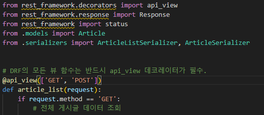

- DRF의 모든 뷰 함수는 반드시 api_view 데코레이터가 필수.

code : 
```python

from rest_framework.decorators import api_view
```

#### Serialization 진행

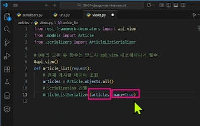

앞쪽의 인자(articles)가 QeurySet 형태일 경우 many 를 True 로 바꿔준다. 

articles 가 다중객체이기때문에 many는 True 바꾼다는 소리다 
many 가 False 면 단일객체 인건가 

#### json 만 추출하기 


    
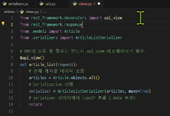

```
from rest_framework.response
```
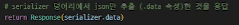
요렇게 해야 json파일만 추출가능

### POST method 생성

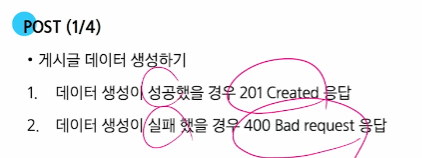


### 우선 조회 함수 

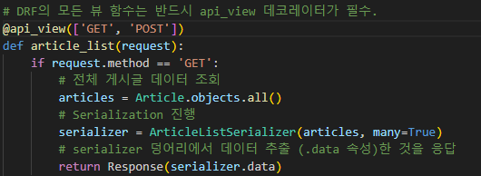

@api_view(['GET']) 요렇게 사용해 조회를 진행할수 있었다 .


### 그다음 post (생성)

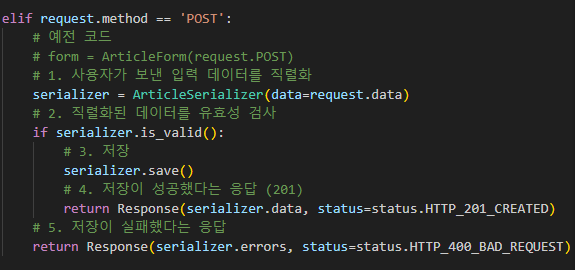

함수를 하나씩 만들필요없이   
article_list 에서 사용자가 입력한 정보를   
보내고 가지고있는 정보를   가져올수있도록 한번에 함수화 시킨다   
그래서 ['GET'] 조건 하나 ['POST'] 조건 하나를 만들어준다

그리고 중요한것은 아까 게시글 데이터 생성하기가 성공했을 경우
저장이 성공했다는 응답을 받기위해서는  
201 create 응답이 필요하기때문에  
그 응답을 받기위한   
```python
from rest_framework import status
```  
 활용도 중요하다.

이렇게 import 할 경우

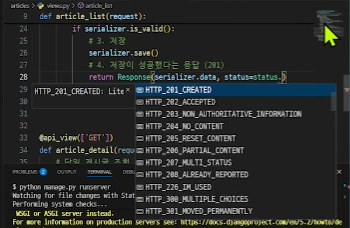

이렇게 여러가지 HTTP 형식을 고를수있다.

그럼 반대로 게시글 생성 저장이 실패했다는 코드를 작성하기위해서는 

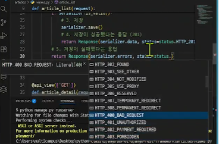

```python 
return Response(serializer.data, status=status.HTTP_400_BAD_REQUEST)
```

를 작성한다.

그래서 전체코드는 

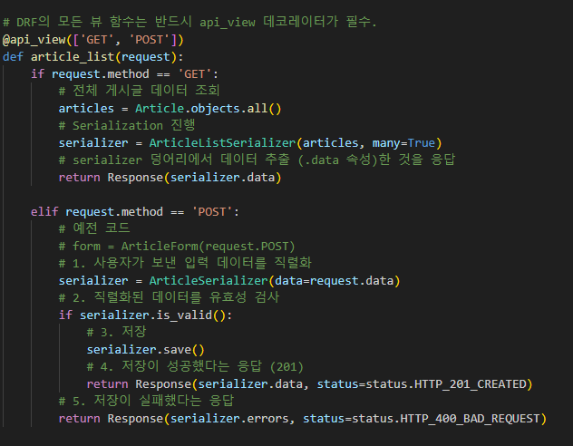

### DELETE 

DELETE 도 위와 큰차이 없이 진행할 수 있다.

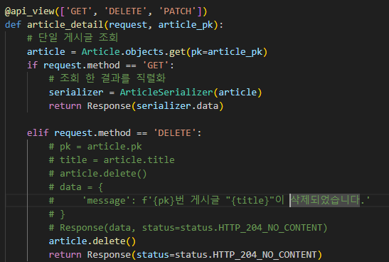

공통점은 

@api_view(['GET']) 을 사용하는것은 똑같고 추가로 
'DELETE' 메서드를 넣는다.

전체 게시글 조회라면 
```python 

articles = Article.objects.all()
```
요렇게 조회할 데이터를 가져올수있겠지만

단일 게시글 조회라면

```python 
article = Article.objects.get(pk=article_pk)
```

이렇게 시작한다.

차이점은 delete 이기때문에 
당연히 메서드는 'DELETE' 메서드를 사용해줘야한다.

status 는 203 !!


### PUT, PATCH (수정)

PUT 은 전체 수정일때
PATCH 는 일부 수정일때

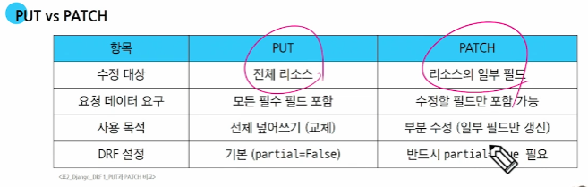

부분업데이트할때 또 중요한건

```python 

# 데이터 일부만 수정할려면 
        serializer = ArticleSerializer(article, data=request.data, partial=True)
```
partial=True 를 작성해줘야한다.
그래서 partial=True 를 쓸경우 
PATCH 매서드를 사용

PUT 은 partial=False