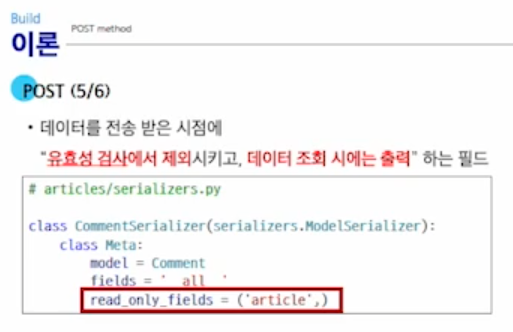
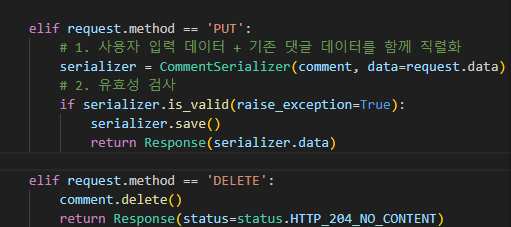
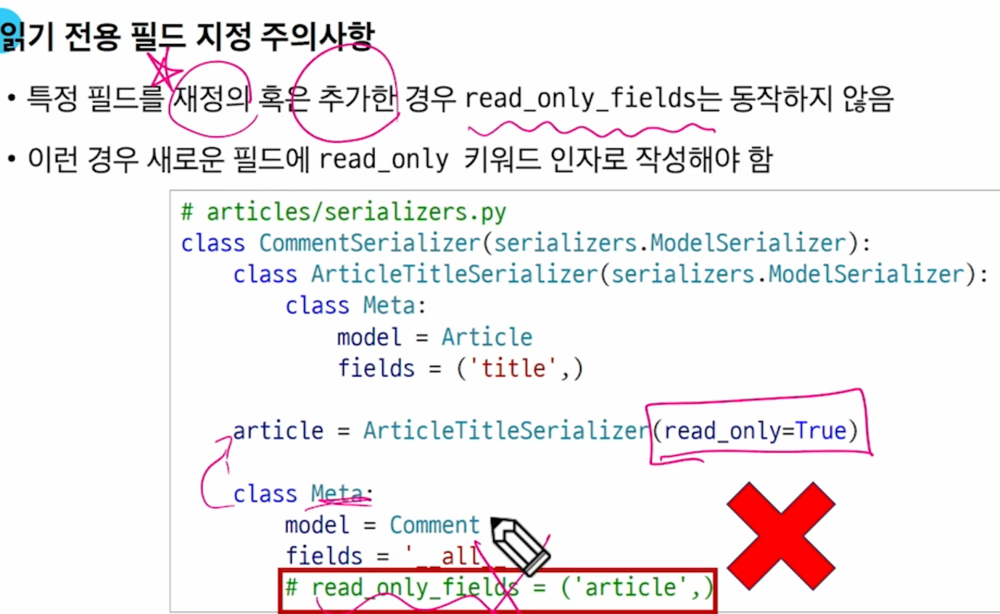
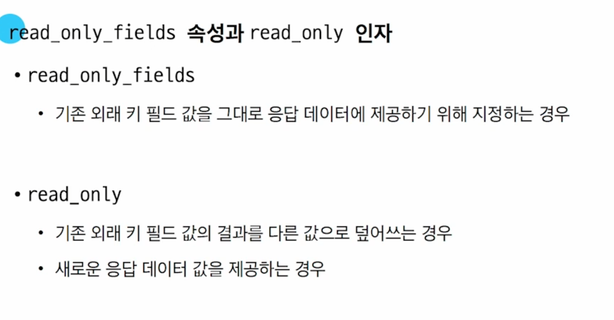
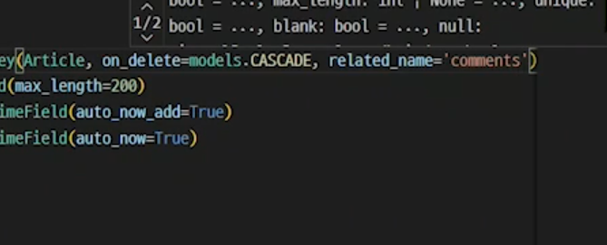
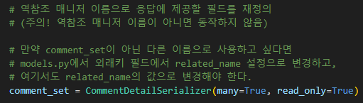

# DRF with 1N:Relation

## POST

유효성 검사에서 제외시키고 , 데이터조회시에는 출력할 수 있는 필드



```python 
read_only_fields = ('article',)
```

## is_valid()

유효성검사에서 실패하면 400 코드를 반환해주는 기능은



```python 
if serializer.is_valid(raise_exception=True)
```


## 특정필드를 재정의 할때



- 읽기 전용 필드 주의사항



## 정의된 이름을 바꾸고싶다면?



```python 
related_name = 'comments'  
```

