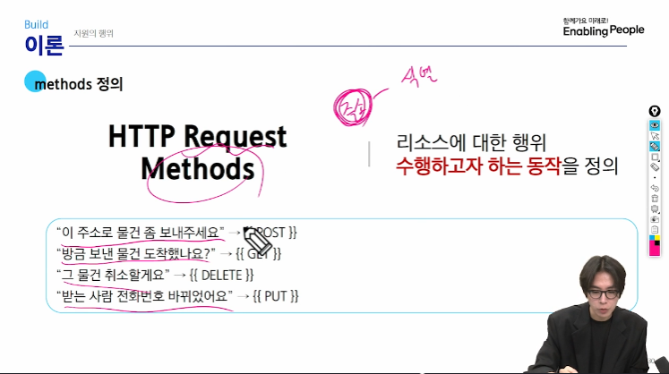
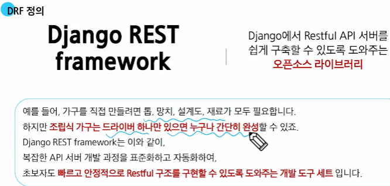
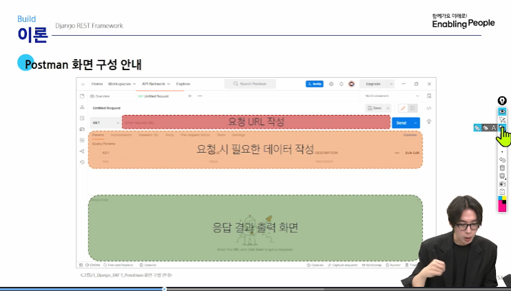
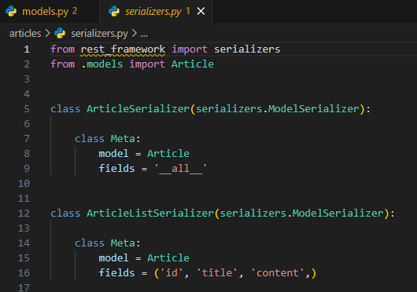
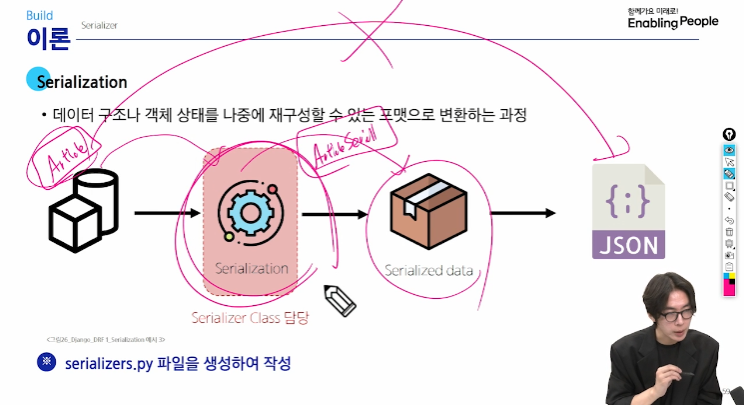

# REST API

기본 용어 :

- URI 통합 자원 식별자  

인터넷에서 리소스(자원)를 식별하는 문자열
(그 자원의 주소를 의미하는게 URL)

methods 정의 : 

### DRF 정의 

### Postman 화면 구성

### Serialization

- 어디서든 읽고 사용할 수 있게 만드는 공통 언어로의 번역

어떠한 언어나 환경에서도 다시 쉽게 사용할 수 있는 포맷으로 변환하는 과정!

즉, 데이터베이스를 여러 타입(json, java, c++ , python)으로 변형 시켜줄수 있게 도와준다

장고사용자가 고객이기에 장고의 형태를 거의 그대로 재현했다고 볼 수 있다.